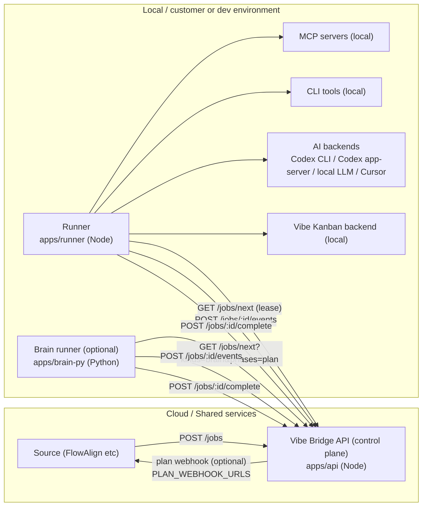
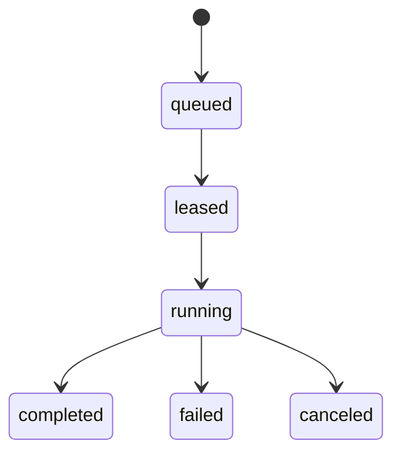
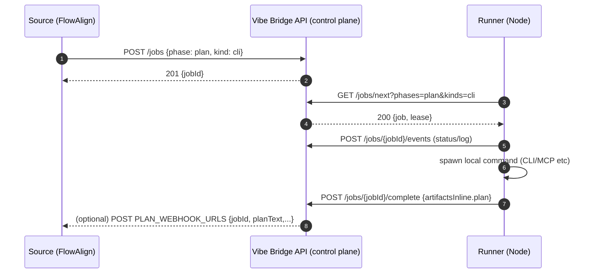
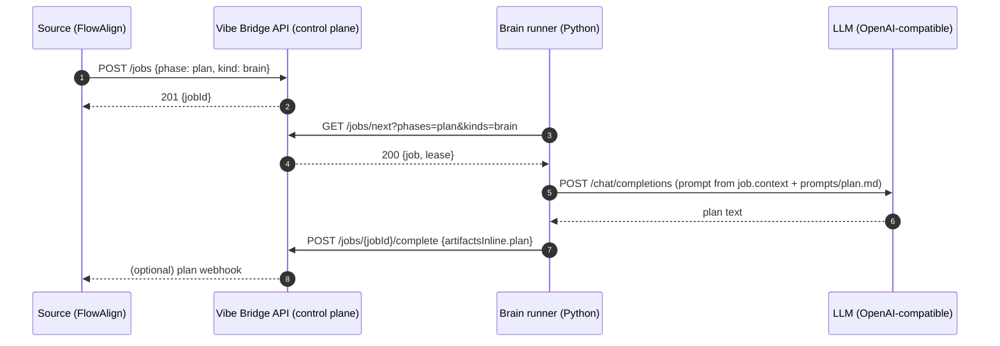

# Vibe Bridge 構成 / 通信（日本語）

## 目的

- 社内サービス（FlowAlign/Flowlog/Caseflow など）が作った「やってほしい作業」を Job として集約する
- runner は **ローカル環境（顧客/開発者PC）** に置き、MCP/CLI/Vibe Kanban 等の **ローカル専用ツール** を安全に実行する
- runner は inbound port を開けず、**pull（長輪講）** で job を取りに行く

## コンポーネント

- **Source（例: FlowAlign）**: Job を作る側（UI/業務フローの入口）
- **Control Plane API（`apps/api` / Node）**: Job の作成・貸出（lease）・状態管理・plan 保存/承認・webhook を担当
- **Runner（`apps/runner` / Node）**: `GET /jobs/next` で job を pull し、ローカルで CLI / Vibe Kanban / AI backend を実行して結果を返す
- **Brain Runner（`apps/brain-py` / Python / 任意）**: `kind=brain` の `phase=plan` を pull して LLM で plan を生成する
- **Local executors**: MCP servers / CLI tools / Vibe Kanban backend など

## 全体アーキテクチャ（Mermaid）

## Job の状態遷移

※ lease が切れた場合の再キューや heartbeat は今後の拡張ポイント（現状は最小の実装）。

## 通信フロー（plan job / CLI runner）

## 通信フロー（plan job / brain runner）

## API（ざっくり）

- `POST /jobs`: Job 作成
- `GET /jobs/next`: 次の job を lease して返す（query で tenant/kinds/phases 絞り込み）
- `GET /jobs/:id`: job 参照（planText/planStatus/result/events を含む）
- `POST /jobs/:id/events`: ログ/質問/ステータスの追記
- `POST /jobs/:id/complete`: 完了（result を確定）
- `POST /jobs/:id/approve`: plan 承認（任意で execute job を生成）

## AI backend（`kind=ai`）

`kind=ai` は「Slack / webhook / SQS / API などの入口から作られた Job を、ローカルの AI 実行系に渡す」ための汎用 executor です。

- 選択: `params.aiBackend`（または `VIBE_BRIDGE_AI_BACKEND`）
- 対応:
  - `codex-cli`: `codex exec`
  - `codex-app-server`: Codex app-server daemon + `codex exec --remote ...`
  - `local-llm`: OpenAI-compatible `/chat/completions`
  - `cursor-cli`: `VIBE_BRIDGE_CURSOR_COMMAND` テンプレート
  - `command`: `VIBE_BRIDGE_AI_COMMAND` テンプレート
- 入力: `params.prompt` または `context`
- 出力:
  - `phase=plan`: `artifactsInline.plan`
  - `phase=execute`: `artifactsInline.response`

## Plan → Execute のゲート（考え方）

- `phase=plan` は「提案/下書き」を作るフェーズ
- `phase=execute` は「承認済み plan を元に実行する」フェーズ
- control plane が `approve` を受けて execute job を生成できる（UI は後で追加）

## セキュリティ / 境界

- runner は inbound port を開けない（`GET /jobs/next` の pull）
- control plane は bearer token（`API_TOKEN`）で保護できる
- webhook は control plane → Source への push（必要なら Source 側で token 検証）
