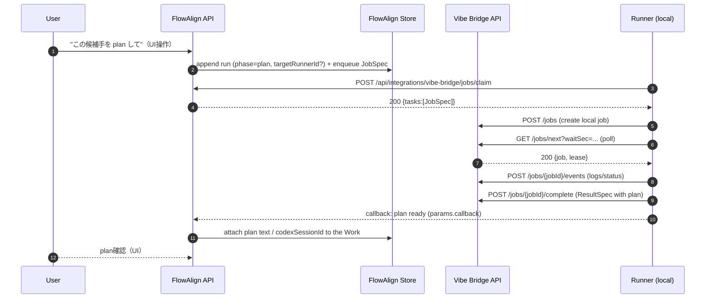
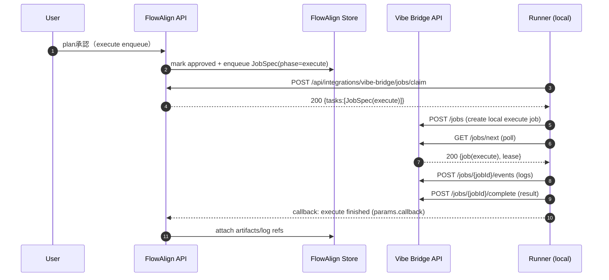
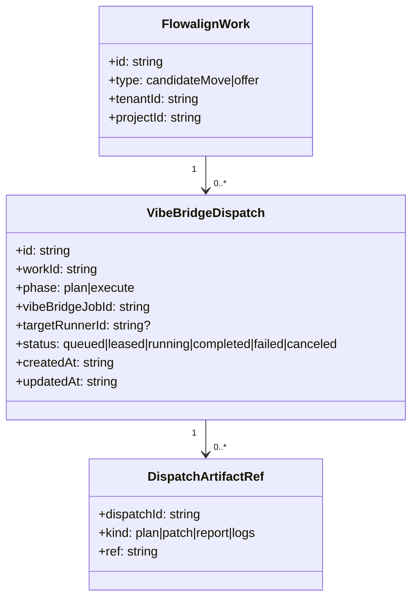

# FlowAlign ↔ Vibe Bridge 連携仕様（Draft）

このドキュメントは、FlowAlign の「Work（候補手/オファー）」を Vibe Bridge に渡して
ローカル実行（MCP/CLI/Vibe Kanban）してもらうための **連携の設計図**です。

## 1. 目的 / Non-goals

### 1.1 目的
- FlowAlign から **「plan / execute」** を Vibe Bridge の Job として投入し、ローカル環境で安全に実行する
- FlowAlign は **どの Vibe Bridge Runner（インスタンス）に依頼したか**を保持できる
- Pullモデルを維持しつつ、複数の内部サービス（将来: Flowlog/Caseflow など）からのジョブ投入を共通化する

### 1.2 Non-goals
- Vibe Bridge が “脳（LLM）” になること（脳は別プロセス/別責務）
- FlowAlign が実行管理ツール（監視/評価ログ）になること
- いきなり完全自動化（まずは **plan を人間が承認**するゲートを固定）

## 2. 用語（FlowAlign ↔ Vibe Bridge）

- FlowAlign:
  - **CandidateMove（候補手）**: まだタスクではない（assignee を持たない）
  - **Offer（タスク相当）**: accept した瞬間に commit（心理安全: decline はログにしない）
- Vibe Bridge:
  - **JobSpec**: 実行依頼（`phase: plan|execute`）
  - **Runner**: ローカル実行主体（pullでジョブを lease）

## 3. 連携の全体像（コンポーネント）

```mermaid
flowchart LR
  subgraph FA[FlowAlign]
    FAUI[UI]
    FAAPI[API]
    FASTORE[(Store)]
  end

  subgraph VB[Vibe Bridge]
    VBAPI[Control Plane API]
    VBWEB[Web UI]
    VBSHARED[JobSpec/ResultSpec]
  end

  subgraph RUNNER[Runner (local)]
    R[Runner]
    MCP[MCP Servers]
    CLI[CLI Tools]
    VK[Vibe Kanban]
  end

  FAUI --> FAAPI --> FASTORE
  FAAPI -->|enqueue JobSpec| FASTORE
  R -->|claim JobSpec| FAAPI
  R -->|POST /jobs| VBAPI
  VBAPI -->|lease JobSpec| R
  R -->|execute| MCP
  R -->|execute| CLI
  R -->|execute| VK
  R -->|events/result| VBAPI
  VBWEB --> VBAPI
  R -->|callback (result)| FAAPI
  FAAPI -->|attach refs| FASTORE
```

## 4. JobSpec の写像（FlowAlign（queue）→ Vibe Bridge）

### 4.1 最小の JobSpec（共通）
- `tenantId`: FlowAlign tenantId
- `projectId`: FlowAlign projectId（uuidv7）
- `phase`: `plan` or `execute`
- `kind`: 実行先（`mcp` / `cli` / `vibeKanban` / `vibeKanban.mcp` / `ai`）
- `idempotencyKey`: **FlowAlign側の run ID + phase** で冪等化（Work あたり複数runを許容する）
- `params`:
  - `source`: `"flowalign"`
  - `flowalignWorkType`: `"candidateMove" | "offer"`
  - `flowalignWorkId`: string
  - `flowalignOfferRunId?`: Offer の run id（FlowAlignが実行Attemptを識別するため）
  - `targetRunnerId?`: 依頼先 Runner のヒント（FlowAlign が保持する）
  - `runnerSelector?`: 将来用（labels 等）

### 4.2 plan フェーズ（推奨の最初の一歩）
- 入力: CandidateMove（候補手）または Offer（タスク）
- 出力: `JobResult.artifactsInline.plan`（または `artifacts.plan`）として plan テキストを返す
- FlowAlign: plan を画面に表示し、**承認（approve）でのみ execute を作る**
- 実装例:
  - `kind=brain`: LLMで plan を生成する（例: `apps/brain-py`）
  - `kind=cli`: ローカルの plan コマンド（codex など）で plan を生成する（runner が実行）
  - `kind=ai`: `params.aiBackend` で Codex CLI / Codex app-server / local LLM / Cursor 系 command などを切り替えて plan を生成する

### 4.3 execute フェーズ（コミットした作業のみ）
- 入力: 承認済み plan（参照: `params.planJobId` / `params.planText`）
- 出力: パッチ参照、レポート参照、ログ参照（Runner側のアダプタに依存）

## 5. シーケンス

### 5.1 plan（候補手の検討 → plan生成）



### 5.2 approve → execute（承認ゲート）



## 6. FlowAlign 側の保持情報（最小データモデル案）

FlowAlign は “監視ログ” を持たず、**依頼先と結果の参照**だけを持つ。



補足（AS-IS / 実装の簡略化）:
- FlowAlign 側の最小実装では、Dispatch を独立テーブルにせず **Work内に `runs[]` として保持**してもよい
  - Offer（Work）: `runs[]`（`vibeBridgeJobId` / `planText` / `codexSessionId` など）
  - 失敗時は同じWorkに新しいrunを追加して再試行する（Workは open のまま）

## 7. Runner 指定（「どのインスタンスに依頼したか」）

### 7.1 方針（最小）
- FlowAlign は `targetRunnerId` を **メモとして保持**する（“誰に頼んだか”の最低限）
- Vibe Bridge 側は最初は **ヒント扱い**（`params.targetRunnerId`）
  - 将来: Runner registration + label selector による厳密ルーティング

## 8. セキュリティ / 運用メモ

- FlowAlign は Vibe Bridge のローカル API を直接叩かない（inbound できないため）
- Runner → FlowAlign（queue claim / callback）は Bearer token で保護する（FlowAlign 側の `FLOWALIGN_VIBE_BRIDGE_WEBHOOK_TOKEN(S)` 等）
- Runner → Vibe Bridge API はローカル（`VIBE_BRIDGE_API_TOKEN` 等）で保護する
- Runner は inbound port を開けない（pullで lease）
- **DB（Postgres等）を使う場合は、スキーマ作成/マイグレーションは人間のみ**（このモノレポのルールに従う）

## 9. Vibe Bridge の役割（ワーカー層の必然性）

Vibe Bridge は **「他社/サードパーティに FlowAlign を使わせる時の実行ワーカー層」**として重要です。
MCP と同じ層ではなく、**「誰が・どこで・何を実行するか」**を安全に分離するための中間レイヤーとして位置づけます。

### 9.1 何を解決するか
- **実行の責任分離**: FlowAlign は「何をするか（Work/Offer）」まで、実行は各社/各テナントの Runner が担当
- **ローカルでの完結**: 外に出したくない情報・環境依存の処理・社内ツール連携は Runner 側で完結
- **ワーカーの選択自由**: MCP/CLI/Vibe Kanban など、各社の運用に合わせてワーカーを選べる
- **AI backend の選択自由**: Codex CLI、Codex app-server、Cursor 系 headless CLI、社内 local LLM などを runner 側の設定で切り替えられる
- **運用の標準化**: JobSpec/ResultSpec を共通フォーマットにして、別ツール間の移植性を担保

### 9.2 MCP と違うレイヤー
- MCP は **「ツール呼び出しのプロトコル」**
- Vibe Bridge は **「実行主体（Runner）を束ねる層」**
  - 誰が走らせるか（Runner）
  - どの環境で走るか（ローカル/社内/VPC）
  - どこまでを持ち出さないか（機密境界）

### 9.3 外部提供時の原則（サードパーティ想定）
- **Runner は各社が保有**（FlowAlign 側が実行する前提にしない）
- **秘匿情報は Runner の外に出さない**
  - 例: 社内リポジトリ、顧客情報、契約ドラフト
- **FlowAlign には“参照情報だけ”を返す**
  - 例: 完了ステータス、ログ参照、成果物の保存先 URI

### 9.4 結果の扱い（最小責務）
- Vibe Bridge は **結果を保管するのではなく**、参照先を FlowAlign に返す
- FlowAlign は **「誰が何を実行したか」の記録**のみ保持する

> 注意: ここは外部公開しない前提の運用ガイド。第三者向けに公開する場合は別資料を切る。
