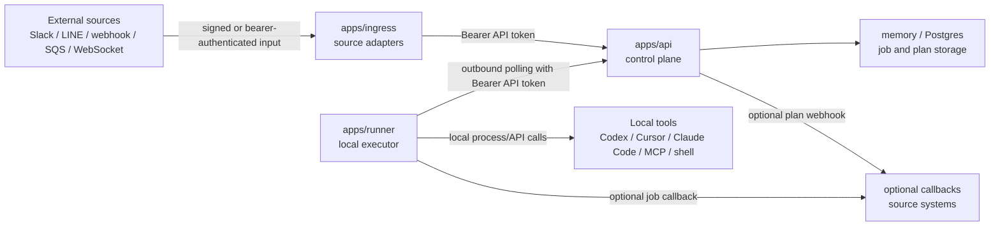

# Vibe Bridge Threat Model

## Scope

This document covers the current Vibe Bridge architecture:

- `apps/api`: control plane for job creation, leasing, status, plans, and result
  storage.
- `apps/ingress`: optional source adapters for webhook, Slack, LINE, SQS, and
  WebSocket inputs.
- `apps/runner`: local outbound runner that leases jobs and executes tools.
- `apps/brain-py`: optional plan-generation worker for `kind=brain`.
- `packages/shared`: `JobSpec`, `JobResult`, and related protocol types.

The primary security goal is to let remote systems request local work without
turning the local machine into an unaudited remote shell.

## Trust Boundaries

Trust boundaries:

- External source to ingress: untrusted unless provider signatures or bearer
  tokens verify.
- Ingress to API: trusted only by `VIBE_BRIDGE_API_TOKEN`.
- API storage: contains job prompts, params, plans, status, and result snippets.
- API to runner: jobs become local execution requests.
- Runner to tools: highest-risk boundary because local files, credentials, and
  developer tools may be reachable.
- Callback egress: can leak results to external URLs if configured loosely.

## Assets

- Local filesystem under and around `VIBE_BRIDGE_WORKSPACE_ROOT`.
- Local developer credentials, SSH keys, cloud credentials, CLI sessions, and
  agent tokens.
- Source code and private repositories checked out by the runner.
- Job queue integrity: tenant, kind, phase, command ID, idempotency key, lease
  state, and attempt count.
- Plans and approval decisions.
- Logs, inline artifacts, and callback payloads.
- API, ingress, Slack, LINE, SQS, WebSocket, LLM, Cursor, Claude, and Codex
  tokens.

## Attacker Profiles

- Internet user who finds a public tunnel or webhook URL.
- Compromised Slack/LINE workspace user or bot event source.
- Cloud account principal with overly broad SQS permissions.
- Malicious or compromised source system sending crafted `JobSpec` payloads.
- Dependency or package publisher compromise.
- Local user or process reading configuration, logs, or workspace output.

## Main Threats and Mitigations

| Threat | Impact | Current mitigation | Required operator control |
| --- | --- | --- | --- |
| Unauthenticated job creation | Remote user can enqueue local work | API bearer token; optional ingress bearer token; Slack/LINE signatures | Always set strong tokens and provider secrets |
| Raw command execution | Remote payload becomes local shell/process execution | Command registry and `VIBE_BRIDGE_COMMANDS_STRICT=1` | Use command IDs; avoid raw `commands.*` from untrusted sources |
| Execute before review | External prompt changes files or runs tools without approval | `JobPhase` supports `plan` and `execute`; ingress defaults to `plan` | Configure external sources as plan-only and approve execute separately |
| Cross-tenant job pickup | Runner processes jobs for the wrong tenant/source | Runner query filters for tenant/kind/phase | Set `VIBE_BRIDGE_RUNNER_TENANT_ID`, `VIBE_BRIDGE_RUNNER_KINDS`, and `VIBE_BRIDGE_RUNNER_PHASES` |
| Secret leakage in logs/artifacts | Tokens or private data copied into API storage/callbacks | Event messages are length-limited | Keep secrets out of prompts/commands; review outputs before forwarding |
| Callback exfiltration | Results sent to attacker-controlled URL | Callback is explicit job data | Restrict callback creation at source; use trusted source systems |
| Webhook spoofing | Fake Slack/LINE/generic webhook creates jobs | Slack and LINE HMAC verification; generic bearer auth | Do not expose unsigned endpoints through public tunnels |
| SQS poisoning | Untrusted AWS principal sends queue messages | AWS IAM controls outside this repo | Use least-privilege queue policies and DLQs |
| Workspace escape | Tool accesses files outside intended project | Runner workspace root is configurable | Use a dedicated workspace and OS-level sandboxing where possible |
| Dependency compromise | Malicious package runs during install/build | Lockfile committed | Review dependency updates and run install/build in controlled environments |

## Secure Deployment Patterns

### Local-only development

- Bind API and ingress to localhost.
- Use `API_TOKEN` even on localhost.
- Set `VIBE_BRIDGE_WORKSPACE_ROOT=~/.vibe-bridge/work`.
- Keep `VIBE_BRIDGE_COMMANDS_STRICT=1` for command-capable demos.

### Public tunnel for Slack or LINE

- Expose only `apps/ingress`.
- Set Slack or LINE signing secrets.
- Keep `VIBE_BRIDGE_INGRESS_DEFAULT_PHASE=plan`.
- Run a separate runner with `VIBE_BRIDGE_RUNNER_PHASES=plan` for external
  sources when possible.
- Use a separate trusted path for execute jobs.

### SQS or WebSocket source

- Use least-privilege queue or stream credentials.
- Require TLS for WebSocket (`wss://`) and bearer auth when supported.
- Use source-specific tenants so runners can filter by tenant.

## Open Hardening Work

These are expected future improvements, not guarantees in the current MVP.

- First-class approval records for plan-to-execute transitions.
- Callback allowlist or signed callback specs.
- Structured secret redaction for logs and inline artifacts.
- Per-tenant runner capability declarations.
- JobSpec schema validation with strict rejection of unknown high-risk fields.
- Optional OS sandbox profiles for command execution.
- Audit events for enqueue, lease, approve, execute, complete, and callback.

## Maintainer Checklist

- New ingress source: document auth, replay protection, idempotency, and tenant
  mapping.
- New runner backend: document what local capabilities it can access and how to
  disable or restrict it.
- New storage backend: document what data persists and how operators should
  back it up or purge it.
- New callback path: document authentication, destination control, retries, and
  data included in payloads.

